# 质量判定解释与让步管理系统 — 业务功能数据库 ER 图

> 文档依据 `backend/scripts/init-schema.sql`、`backend/scripts/init-menu-rbac.sql` 及 `backend/scripts/migrations/20260621_01_ai_quality_p0_schema.sql` 梳理。  
> 说明：本项目表间关联以**逻辑外键**（字段引用 + 索引）为主，DDL 中未声明物理 `FOREIGN KEY` 约束。

---

## 目录

1. [全局表清单与业务归属](#1-全局表清单与业务归属)
2. [核心业务主链路总览](#2-核心业务主链路总览)
3. [系统基础与权限审计](#3-系统基础与权限审计)
4. [标准库与指标主数据](#4-标准库与指标主数据)
5. [标准覆盖缺口](#5-标准覆盖缺口)
6. [标准 RAG 与源文档](#6-标准-rag-与源文档)
7. [检验录入](#7-检验录入)
8. [质量判定与判定解释](#8-质量判定与判定解释)
9. [复检管理](#9-复检管理)
10. [改判管理](#10-改判管理)
11. [让步接收](#11-让步接收)
12. [标准冲突检测与裁决](#12-标准冲突检测与裁决)
13. [质保书数据与质保书问答](#13-质保书数据与质保书问答)
14. [质量统计与质量工作台](#14-质量统计与质量工作台)
15. [AI 评估审计与置信度配置](#15-ai-评估审计与置信度配置)
16. [跨模块关联速查表](#16-跨模块关联速查表)

---

## 1. 全局表清单与业务归属

| 业务功能 | 菜单/模块 | 核心表 | 辅助/关联表 |
|---------|----------|--------|------------|
| 系统基础 | 账号管理、数据字典、菜单/角色管理 | `sys_user`, `sys_dict`, `sys_dict_item`, `sys_role`, `sys_permission`, `sys_menu` | `sys_user_role`, `sys_role_menu`, `sys_role_permission`, `sys_notification` |
| 权限审计 | 权限审计 | `qc_audit_log` | 关联各业务表（多态） |
| 指标项目 | 标准库 → 指标项目 | `qc_indicator_item` | `sys_dict`（INDICATOR_CATEGORY） |
| 标准维护 | 标准库 → 标准维护 | `qc_quality_standard`, `qc_standard_indicator` | `qc_indicator_item`, `sys_dict`（STANDARD_TYPE/STATUS） |
| 覆盖缺口 | 标准库 → 覆盖缺口 | `standard_gap` | `qc_indicator_item`, `qc_inspection_record` |
| 标准 RAG | 标准库 → 标准 RAG 检索 | `qc_standard_document`, `qc_standard_clause` | `qc_quality_standard`, `qc_indicator_item` |
| 检验录入 | 检验与判定 → 检验录入 | `qc_inspection_record`, `qc_inspection_value` | `qc_indicator_item`, `sys_user` |
| 判定解释 | 检验与判定 → 判定解释 | `qc_judgment_result`, `qc_judgment_evidence` | `qc_inspection_record`, `qc_quality_standard`, `qc_indicator_item` |
| 复检管理 | 质量流程 → 复检管理 | `qc_reinspection_record` | `qc_judgment_result`, `qc_inspection_record` |
| 改判管理 | 质量流程 → 改判管理 | `qc_rejudgment_request`, `qc_rejudgment_approval` | `qc_judgment_result`, `sys_user` |
| 让步接收 | 质量流程 → 让步接收 | `qc_concession_acceptance` | `qc_judgment_result`, `alternative_stock`, `qc_customer_usage_profile` |
| 标准冲突 | 质量流程 → 标准冲突检测 | `standard_conflict` | `qc_judgment_result`, `qc_inspection_record`, `qc_quality_standard`, `qc_indicator_item` |
| 质保书数据 | 数据汇总 → 质保书数据 | `qc_quality_cert_data` | `qc_inspection_record`（逻辑：coil_no/batch_no） |
| 质保书问答 | 数据汇总 → 质保书问答 | `qc_ai_assessment` | `qc_quality_cert_data`, `qc_standard_clause` |
| 质量统计 | 数据汇总 → 质量统计 | — | 聚合查询 `qc_judgment_result`、`qc_inspection_record`、`qc_concession_acceptance` 等 |
| 质量工作台 | 质量工作台 | — | 聚合查询各流程待办表 |
| AI 评估审计 | 管理员 → AI 评估审计 | `qc_ai_assessment` | 各业务主表（多态） |
| AI 置信度配置 | 管理员 → AI 置信度配置 | `qc_ai_confidence_config` | — |
| AI 降级缓存 | 后端内部 | `qc_ai_cache` | `qc_ai_assessment`（cache_key） |
| 评测用例 | 后端/演示 | `qc_evaluation_case` | — |

---

## 2. 核心业务主链路总览

从检验录入到质保书输出的主数据流：

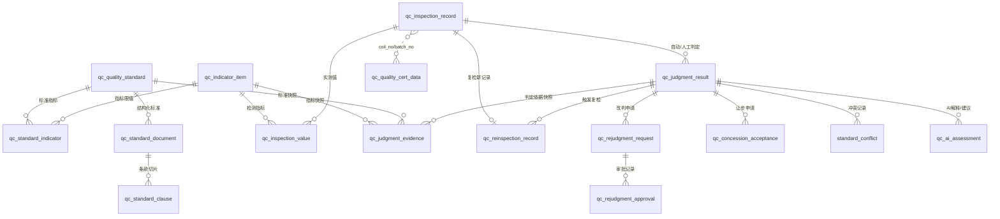

---

## 3. 系统基础与权限审计

**功能说明**：用户认证、RBAC 权限、数据字典、站内通知、操作审计。

```mermaid
erDiagram
    sys_user ||--o{ sys_user_role : "用户角色"
    sys_role ||--o{ sys_user_role : "角色用户"
    sys_role ||--o{ sys_role_menu : "角色菜单"
    sys_menu ||--o{ sys_role_menu : "菜单角色"
    sys_role ||--o{ sys_role_permission : "角色权限"
    sys_permission ||--o{ sys_role_permission : "权限角色"
    sys_menu ||--o{ sys_menu : "parent_id 树形"
    sys_dict ||--o{ sys_dict_item : "dict_code"
    sys_user ||--o{ sys_notification : "receiver_no=user_no"

    sys_user {
        varchar id PK
        varchar user_no UK
        varchar username
        varchar role "遗留字段，已迁移至 sys_user_role"
        tinyint status
    }

    sys_role {
        varchar id PK
        varchar role_code UK
        varchar role_name
    }

    sys_permission {
        varchar id PK
        varchar perm_code UK
        varchar perm_type "MENU/BUTTON/API"
    }

    sys_menu {
        varchar id PK
        varchar parent_id
        varchar menu_name
        varchar path
        varchar perm_code
    }

    sys_user_role {
        varchar id PK
        varchar user_id FK逻辑
        varchar role_id FK逻辑
    }

    sys_role_menu {
        varchar id PK
        varchar role_id
        varchar menu_id
    }

    sys_role_permission {
        varchar id PK
        varchar role_id
        varchar permission_id
    }

    sys_dict {
        varchar id PK
        varchar dict_code UK
        varchar dict_name
    }

    sys_dict_item {
        varchar id PK
        varchar dict_code
        varchar item_value
        varchar item_label
    }

    sys_notification {
        varchar id PK
        varchar receiver_no
        varchar related_type
        varchar related_id
        tinyint is_read
    }

    qc_audit_log {
        bigint id PK
        varchar operation_type
        varchar target_entity
        varchar target_id
        varchar operator_no
        datetime operate_time
    }
```

**关联说明**

| 关联 | 关联字段 | 关系 | 备注 |
|-----|---------|------|------|
| 用户 ↔ 角色 | `sys_user_role.user_id` → `sys_user.id` | N:M | 一个用户可有多角色 |
| 角色 ↔ 菜单 | `sys_role_menu` | N:M | 控制前端路由可见性 |
| 角色 ↔ 权限 | `sys_role_permission` | N:M | 控制按钮/API 权限 |
| 字典分类 ↔ 字典项 | `sys_dict_item.dict_code` → `sys_dict.dict_code` | 1:N | |
| 通知 ↔ 用户 | `sys_notification.receiver_no` → `sys_user.user_no` | N:1 | 工号关联 |
| 通知 ↔ 业务 | `related_type` + `related_id` | 多态 | 如改判、让步待办 |
| 审计 ↔ 业务 | `target_entity` + `target_id` | 多态 | 记录标准、改判、让步等变更 |

---

## 4. 标准库与指标主数据

**功能说明**：维护国标/企标/客协标准及其指标限值；判定引擎的结构化真相源。

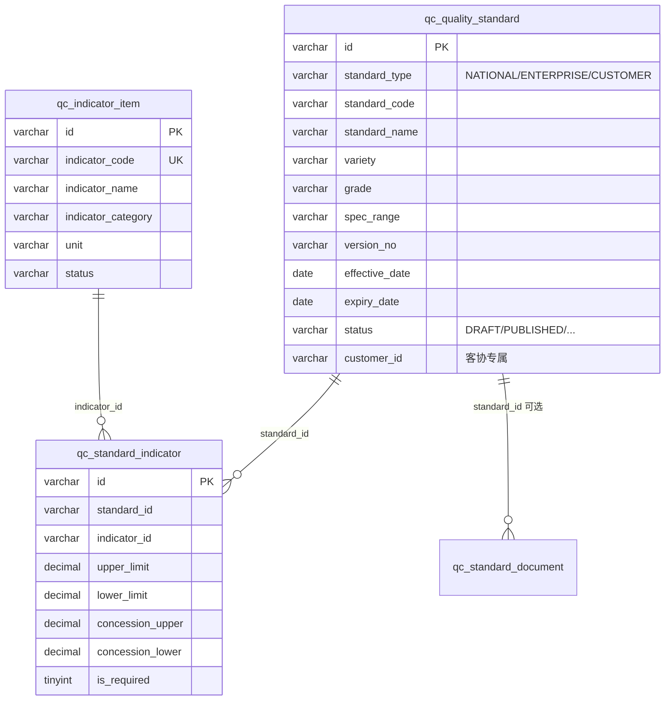

**关联说明**

| 关联 | 关联字段 | 关系 | 备注 |
|-----|---------|------|------|
| 标准 → 标准指标 | `qc_standard_indicator.standard_id` | 1:N | 联合唯一 `(standard_id, indicator_id)` |
| 指标 → 标准指标 | `qc_standard_indicator.indicator_id` | 1:N | |
| 标准 → 客户 | `qc_quality_standard.customer_id` | N:1 | 引用字典 `QC_CUSTOMER`，非独立客户表 |
| 标准优先级 | 业务规则 | — | 客协 > 企标 > 国标（非表关联） |

---

## 5. 标准覆盖缺口

**功能说明**：判定时发现某品种/牌号缺少指标限值定义，记录缺口并跟踪处理。

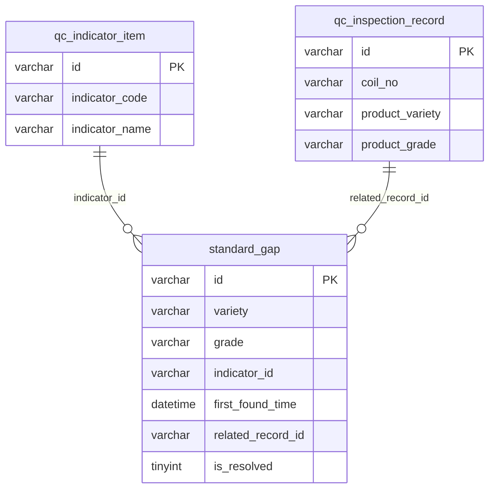

---

## 6. 标准 RAG 与源文档

**功能说明**：标准 PDF/协议/案例文档解析、条款切片、向量索引；为判定解释与 RAG 检索提供引用原文（不覆盖结构化限值）。

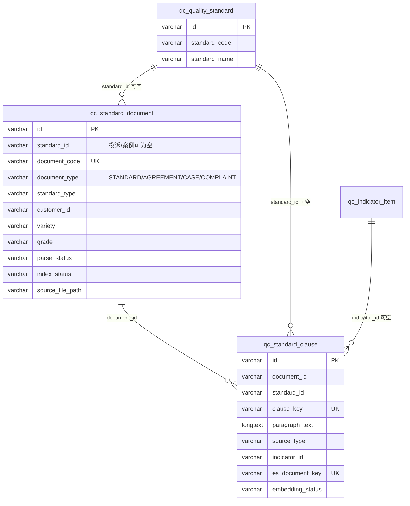

**外部存储**：条款向量实际索引在 Elasticsearch（`es_document_key`），MySQL 仅存元数据与原文镜像。

---

## 7. 检验录入

**功能说明**：录入炉号/卷号/批次检验记录及各项实测值。

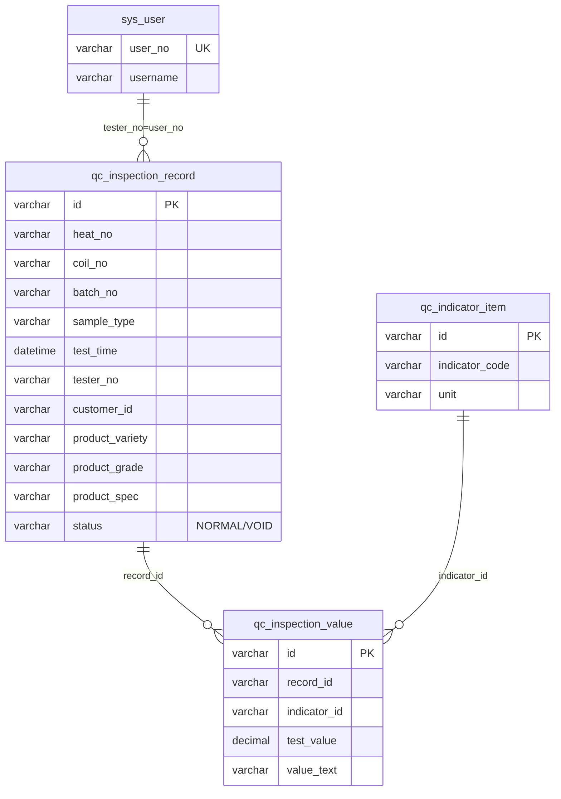

**关联说明**

| 关联 | 关联字段 | 关系 | 备注 |
|-----|---------|------|------|
| 检验记录 → 检验值 | `qc_inspection_value.record_id` | 1:N | 联合唯一 `(record_id, indicator_id)` |
| 检验值 → 指标 | `qc_inspection_value.indicator_id` | N:1 | |
| 检验记录 → 检验员 | `qc_inspection_record.tester_no` | N:1 | 逻辑关联 `sys_user.user_no` |
| 检验记录 → 客户 | `qc_inspection_record.customer_id` | N:1 | 字典项，用于匹配客协标准 |

---

## 8. 质量判定与判定解释

**功能说明**：规则引擎对检验记录自动判定，生成结论与指标级依据快照；支持 AI 判定解释（见第 15 节）。

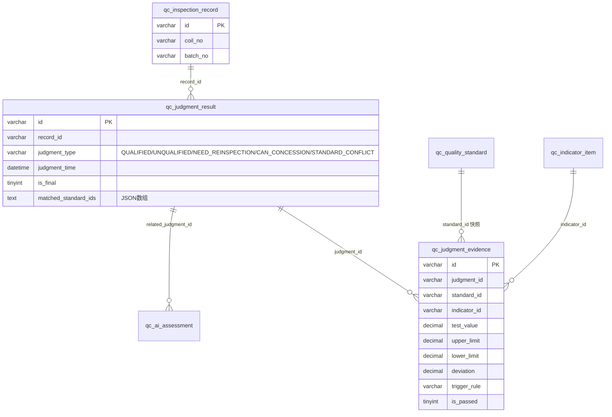

**关联说明**

| 关联 | 关联字段 | 关系 | 备注 |
|-----|---------|------|------|
| 检验记录 → 判定 | `qc_judgment_result.record_id` | 1:N | 仅一条 `is_final=1` 为当前最终结论 |
| 判定 → 依据 | `qc_judgment_evidence.judgment_id` | 1:N | 快照设计，限值不随标准变更而变 |
| 判定 → 命中标准 | `matched_standard_ids`（JSON） | N:M 逻辑 | 存储标准 ID 列表，非关系表 |
| 一条检验记录完整链路 | record → values → judgment → evidence | — | 判定引擎核心读取路径 |

---

## 9. 复检管理

**功能说明**：对需复检的判定结论发起复检流程，关联新的检验记录。

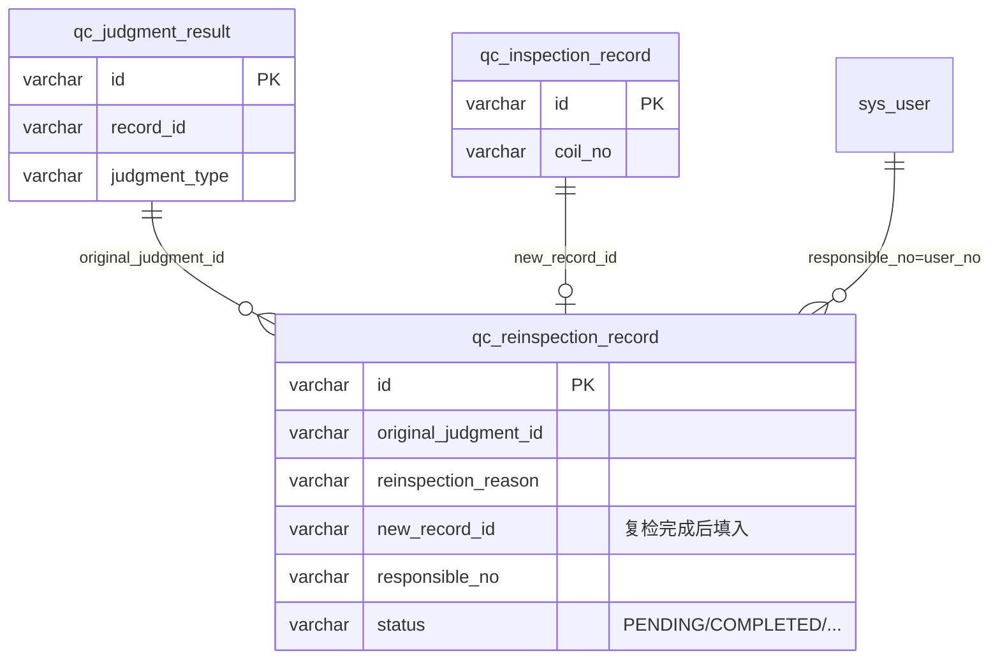

**业务链路**：原判定（`NEED_REINSPECTION`）→ 创建复检记录 → 录入新检验记录 → 对新记录重新判定。

---

## 10. 改判管理

**功能说明**：人工申请将判定结论改为其他类型，经多级审批后生效。

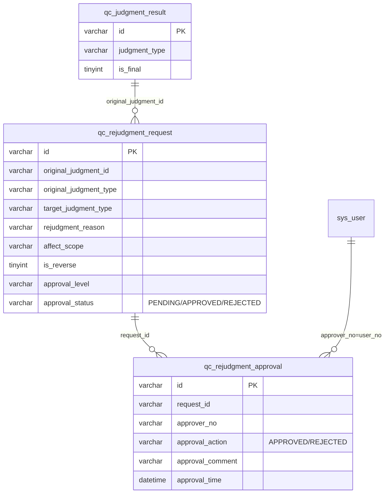

**审批通过后**：原判定 `is_final` 置 0，生成新判定记录；逆向改判需附加证据附件。

---

## 11. 让步接收

**功能说明**：对可让步判定结论发起让步申请，经客户确认与多级审批后生效。

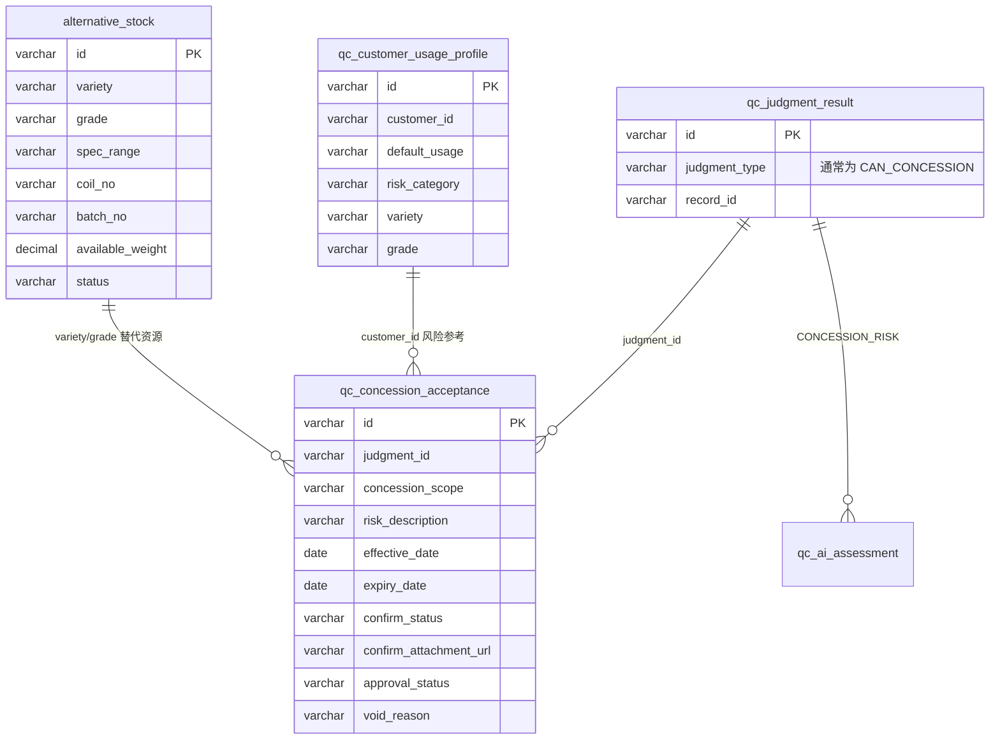

**关联说明**

| 关联 | 方式 | 备注 |
|-----|------|------|
| 让步 → 判定 | `judgment_id` | 直接外键逻辑 |
| 让步 → 客户用途 | 经判定 → 检验记录 → `customer_id` 匹配 `qc_customer_usage_profile` | 业务查询关联 |
| 让步 → 替代库存 | 按 `variety`/`grade`/`spec_range` 匹配 `alternative_stock` | 无直接 FK，AI 风险评估用 |
| 让步 → 检验记录 | `judgment_id` → `record_id` | 间接关联 |

---

## 12. 标准冲突检测与裁决

**功能说明**：多标准限值冲突时阻断判定或生成冲突工单，人工裁决后重新判定。

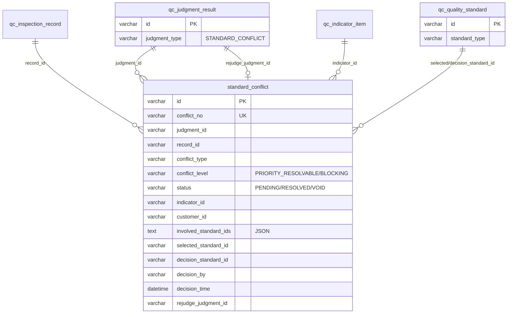

**裁决完成后**：写入 `decision_standard_id`、`rejudge_judgment_id` 指向新判定结论。

---

## 13. 质保书数据与质保书问答

**功能说明**：按卷号/批次汇总合格指标生成质保书 JSON 快照；AI 问答基于快照与标准条款引用。

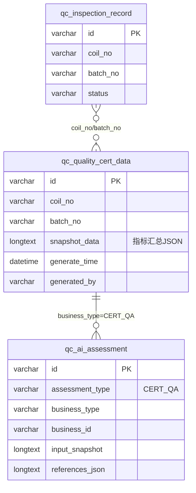

**约束**：存在未解决标准冲突时不允许生成正式质保书（业务规则，非 DB 约束）。

---

## 14. 质量统计与质量工作台

**功能说明**：无独立业务表，通过聚合查询现有表实现。

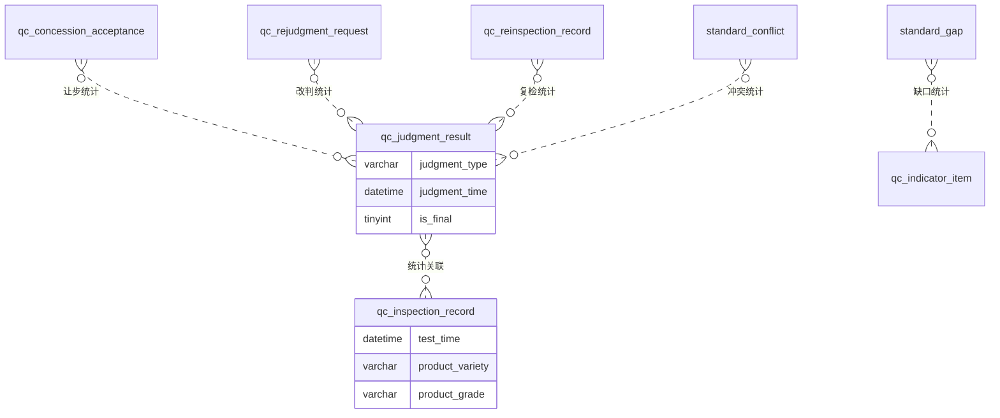

**常用统计维度**：判定结论分布、品种/牌号合格率、让步/改判/复检待办数、标准缺口未处理数。

---

## 15. AI 评估审计与置信度配置

**功能说明**：持久化 AI 输出（判定解释、让步风险、复检/改判建议、RAG 检索、质保书问答），支持降级、缓存与人工采纳审计。

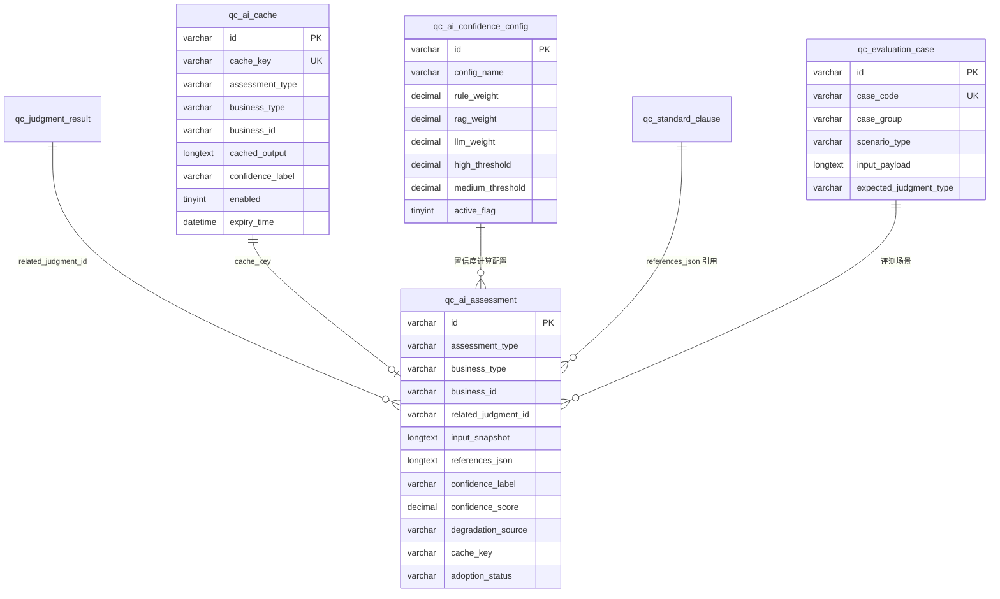

**`qc_ai_assessment.business_type` / `business_id` 多态映射**

| assessment_type | 典型 business_type | business_id 指向 |
|----------------|-------------------|-----------------|
| JUDGMENT_EXPLANATION | JUDGMENT | `qc_judgment_result.id` |
| CONCESSION_RISK | CONCESSION / JUDGMENT | 让步或判定 ID |
| REINSPECTION_ADVICE | JUDGMENT | 判定 ID |
| REJUDGMENT_ADVICE | REJUDGMENT | 改判申请 ID |
| CERT_QA | CERT_DATA | 质保书数据 ID |
| STANDARD_RAG | — | 检索会话/查询上下文 |

---

## 16. 跨模块关联速查表

| 源表 | 目标表 | 关联字段 | Cardinality | 所属业务 |
|-----|-------|---------|-------------|---------|
| `qc_standard_indicator` | `qc_quality_standard` | `standard_id` | N:1 | 标准库 |
| `qc_standard_indicator` | `qc_indicator_item` | `indicator_id` | N:1 | 标准库 |
| `qc_inspection_value` | `qc_inspection_record` | `record_id` | N:1 | 检验录入 |
| `qc_inspection_value` | `qc_indicator_item` | `indicator_id` | N:1 | 检验录入 |
| `qc_judgment_result` | `qc_inspection_record` | `record_id` | N:1 | 判定 |
| `qc_judgment_evidence` | `qc_judgment_result` | `judgment_id` | N:1 | 判定解释 |
| `qc_judgment_evidence` | `qc_quality_standard` | `standard_id` | N:1 | 判定解释（快照） |
| `qc_judgment_evidence` | `qc_indicator_item` | `indicator_id` | N:1 | 判定解释（快照） |
| `standard_gap` | `qc_indicator_item` | `indicator_id` | N:1 | 覆盖缺口 |
| `standard_gap` | `qc_inspection_record` | `related_record_id` | N:1 | 覆盖缺口 |
| `qc_standard_document` | `qc_quality_standard` | `standard_id` | N:1 | RAG |
| `qc_standard_clause` | `qc_standard_document` | `document_id` | N:1 | RAG |
| `qc_standard_clause` | `qc_quality_standard` | `standard_id` | N:1 | RAG |
| `qc_standard_clause` | `qc_indicator_item` | `indicator_id` | N:1 | RAG |
| `qc_reinspection_record` | `qc_judgment_result` | `original_judgment_id` | N:1 | 复检 |
| `qc_reinspection_record` | `qc_inspection_record` | `new_record_id` | N:1 | 复检 |
| `qc_rejudgment_request` | `qc_judgment_result` | `original_judgment_id` | N:1 | 改判 |
| `qc_rejudgment_approval` | `qc_rejudgment_request` | `request_id` | N:1 | 改判 |
| `qc_concession_acceptance` | `qc_judgment_result` | `judgment_id` | N:1 | 让步 |
| `standard_conflict` | `qc_judgment_result` | `judgment_id` / `rejudge_judgment_id` | N:1 | 冲突 |
| `standard_conflict` | `qc_inspection_record` | `record_id` | N:1 | 冲突 |
| `standard_conflict` | `qc_indicator_item` | `indicator_id` | N:1 | 冲突 |
| `qc_quality_cert_data` | `qc_inspection_record` | `coil_no`, `batch_no` | 逻辑 N:1 | 质保书 |
| `qc_ai_assessment` | 各业务表 | `business_type` + `business_id` | 多态 | AI |
| `qc_ai_assessment` | `qc_judgment_result` | `related_judgment_id` | N:1 | AI |
| `sys_user_role` | `sys_user` / `sys_role` | `user_id` / `role_id` | N:M | 权限 |
| `sys_dict_item` | `sys_dict` | `dict_code` | N:1 | 字典 |
| `qc_audit_log` | 各业务表 | `target_entity` + `target_id` | 多态 | 审计 |

---

## 附录：表数量统计

| 分类 | 表数量 | 表名 |
|-----|-------|------|
| 系统/RBAC | 10 | sys_user, sys_dict, sys_dict_item, sys_notification, sys_role, sys_permission, sys_menu, sys_role_menu, sys_role_permission, sys_user_role |
| 标准/指标 | 6 | qc_indicator_item, qc_quality_standard, qc_standard_indicator, standard_gap, qc_standard_document, qc_standard_clause |
| 检验/判定 | 4 | qc_inspection_record, qc_inspection_value, qc_judgment_result, qc_judgment_evidence |
| 质量流程 | 5 | qc_reinspection_record, qc_rejudgment_request, qc_rejudgment_approval, qc_concession_acceptance, standard_conflict |
| 质保书 | 1 | qc_quality_cert_data |
| AI 增强 | 6 | qc_ai_assessment, qc_ai_cache, qc_ai_confidence_config, alternative_stock, qc_customer_usage_profile, qc_evaluation_case |
| 审计 | 1 | qc_audit_log |
| **合计** | **33** | |

---

*生成时间：2026-06-27 | 数据源：backend/scripts/*
