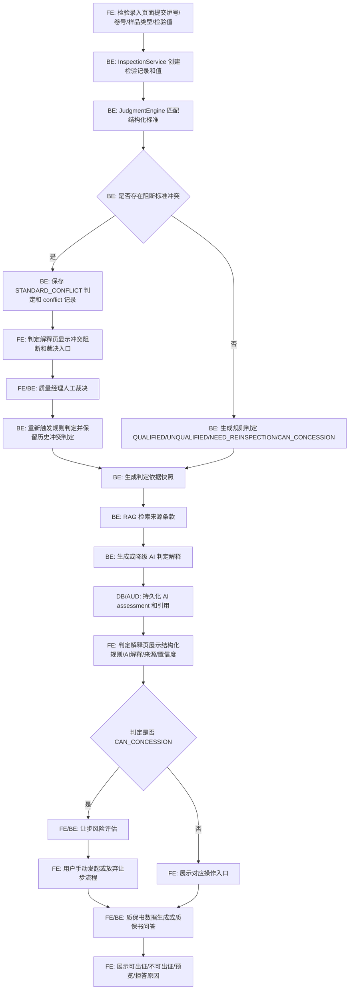
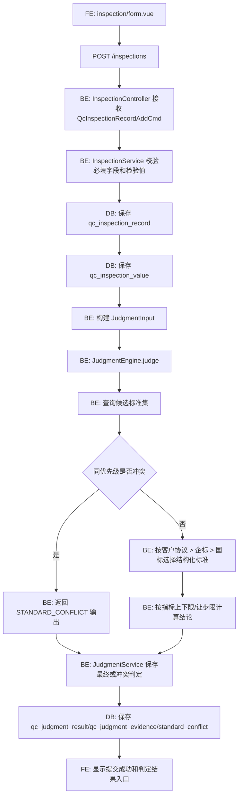
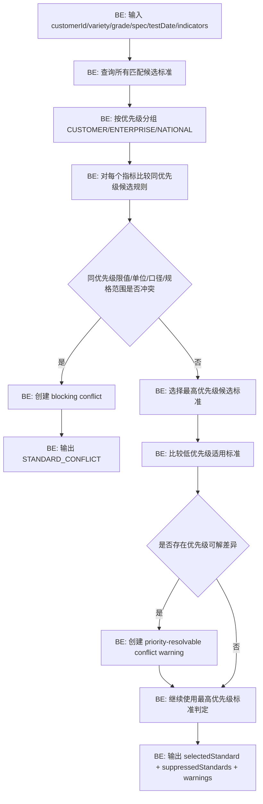
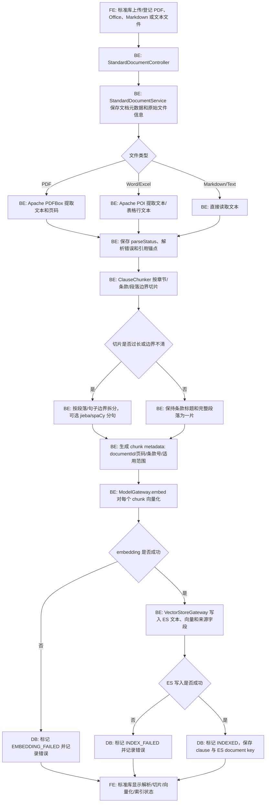
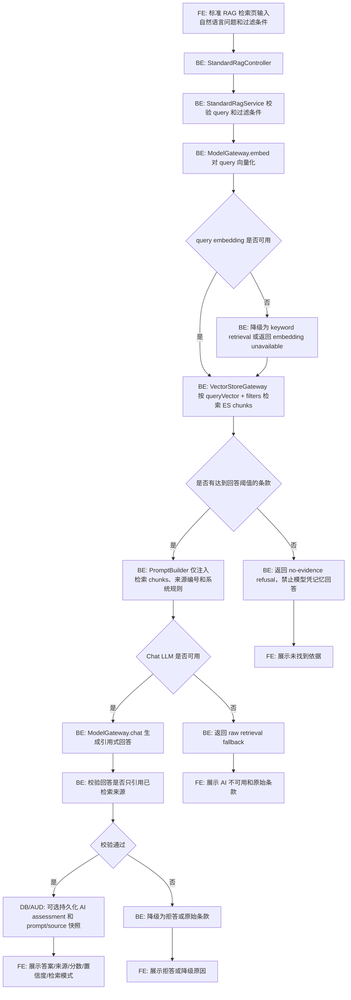
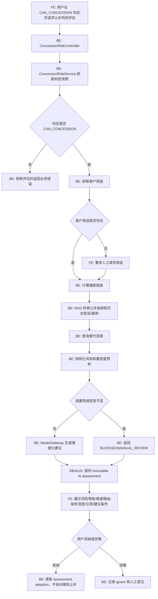
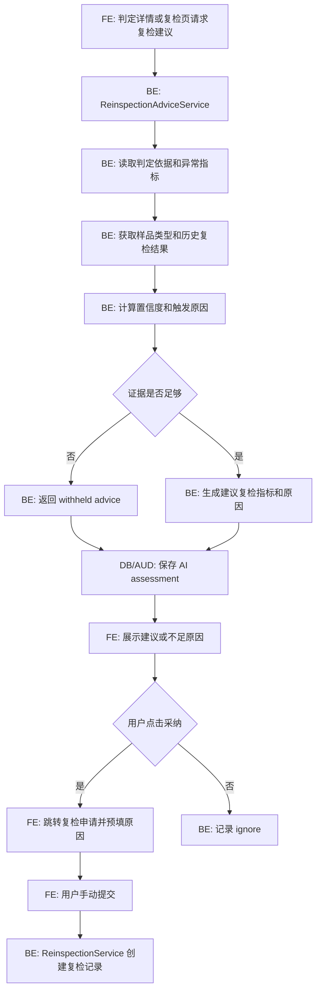
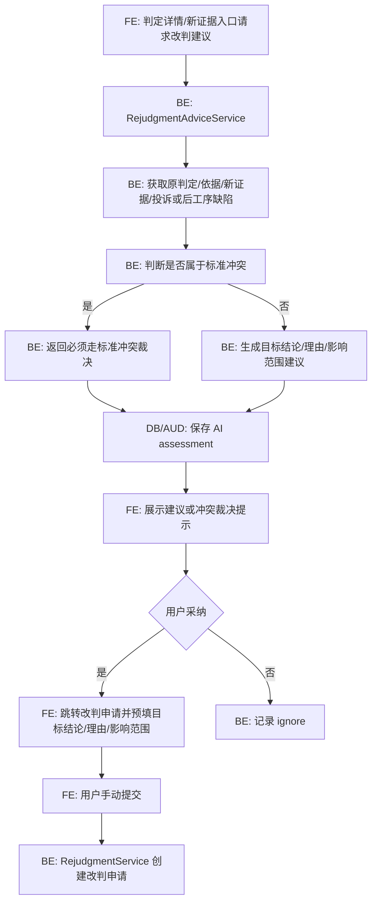
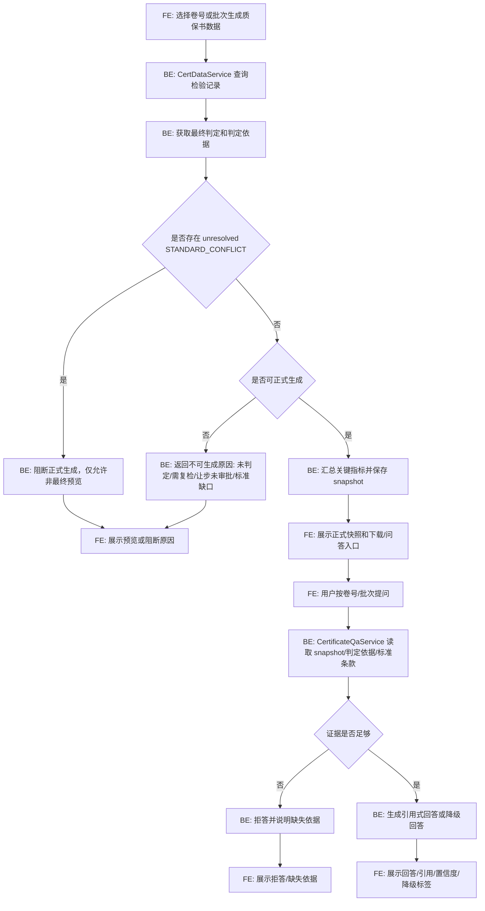
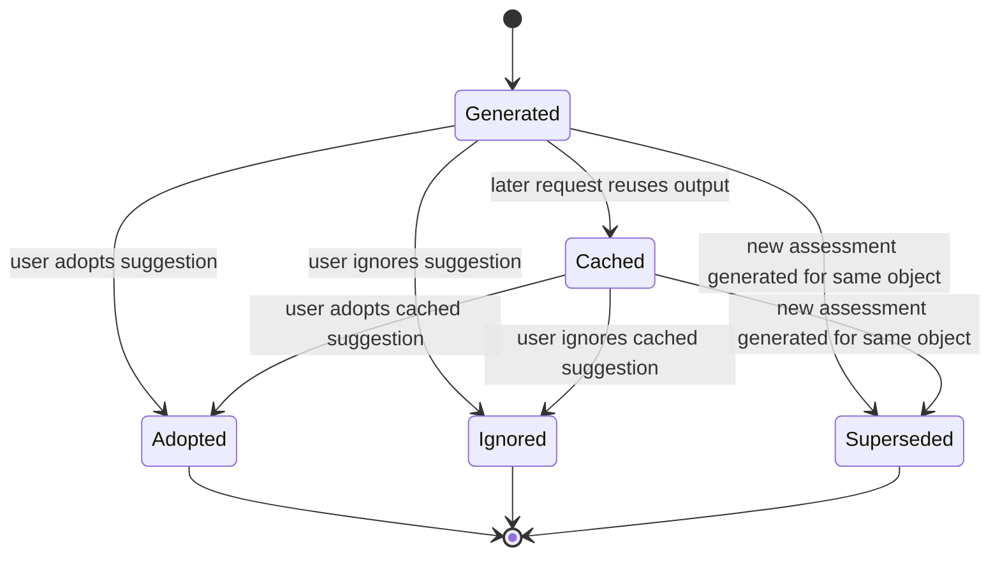

# Business Flowcharts

Status: Draft
Last updated: 2026-06-21
Change: `rag-explained-judgment-concession`

## 1. Purpose

This document is the shared process reference for frontend and backend implementation. It prevents the UI flow, API flow, business rules, AI degradation behavior, and audit behavior from drifting apart.

Mandatory implementation references:

- Frontend implementation MUST follow [frontend/DESIGN.md](../../../frontend/DESIGN.md).
- Backend implementation MUST follow [backend/AGENTS.md](../../../backend/AGENTS.md).
- Backend cross-Service access MUST go through `service/api` methods. A Service MUST NOT call another business domain's Mapper directly.
- Structured standards remain the only source of truth for deterministic judgment.
- RAG clauses are used for retrieval, citation, explanation, and review only.
- AI may explain, suggest, prefill, and warn. AI MUST NOT auto-create or auto-approve reinspection, rejudgment, concession approval, certificate release, or conflict裁决.

## 2. Legend

```text
FE  = Vue page/component following frontend/DESIGN.md
BE  = Spring Controller/Service following backend/AGENTS.md
DB  = MySQL authoritative business persistence
ES  = Elasticsearch retrieval/vector index
LLM = ModelGateway provider, for example an OpenAI-compatible API
AUD = Audit log or immutable AI assessment record
```

## 3. P0 End-To-End Demo Flow

This is the primary final competition flow.



Implementation notes:

- FE must show all conflict, low-confidence, and degradation states. It must not hide them behind a generic error.
- BE must persist the deterministic judgment and evidence before AI explanation is shown.
- Certificate Q&A must answer from certificate snapshot, inspection record, judgment evidence, and cited standard clauses. It must refuse when evidence is missing.

## 4. Inspection Entry And Deterministic Judgment Flow



Backend boundaries:

- `InspectionService` owns inspection record/value persistence.
- `JudgmentService` owns judgment result/evidence persistence.
- If `InspectionService` needs to invalidate or query judgment data, it MUST call `JudgmentService`; it MUST NOT use `QcJudgmentResultMapper` directly.

Frontend boundaries:

- FE submits DTO fields only.
- FE does not calculate final judgment.
- FE may preview entered values but must label any local calculation as non-authoritative if added later.

## 5. Standard Candidate Matching And Conflict Detection Flow



Conflict rules:

- Same-priority numeric differences for the same indicator and overlapping effective/spec range are blocking conflicts.
- Unit mismatch or indicator口径 mismatch is blocking unless a configured conversion/alias rule exists.
- Cross-priority differences are priority-resolvable but must be surfaced in explanation.
- Customer agreement wider than enterprise/national standard is priority-resolvable but must be risk-highlighted.

Data contract alignment:

- BE response should include `selectedStandard`, `candidateStandards`, `suppressedStandards`, `conflicts`, and `warnings`.
- FE must render selected, skipped, warning, and blocking states distinctly.

## 6. Standard Document Ingestion And RAG Retrieval Flow

### 6.1 Document Ingestion And Indexing Flow



Ingestion rules:

- Chunking is deterministic code behavior. The embedding model must not decide where the document is cut.
- Clause headings and paragraph boundaries are preferred. Lightweight NLP sentence segmentation is only a fallback for unclear text boundaries.
- PDF/Office/table extraction output is retrieval evidence only. It must not become structured judgment truth unless a human维护标准指标后写入结构化标准表.
- Every indexed ES chunk must contain source text, embedding vector, document metadata, citation anchors, applicability metadata, and index status traceability.

### 6.2 Standard RAG Retrieval Flow



Security rules:

- FE renders model output and source paragraphs as escaped text.
- BE treats user query and retrieved clauses as untrusted input.
- LLM must not answer from memory when retrieval evidence is missing.
- Chat prompt must include only retrieved chunks plus grounding rules; it must not include hidden unverified standard limits.
- Retrieval responses should expose whether embedding retrieval was used, whether keyword fallback was used, and how many chunks were sent to chat.

## 7. AI Judgment Explanation And Degradation Flow

```mermaid
flowchart TD
    A[FE: 打开判定解释详情] --> B[GET /judgments/{id}/explanation]
    B --> C[BE: JudgmentService 读取判定和依据快照]
    C --> D[BE: 检查冲突/标准缺口/结构化文档不一致]
    D --> E[BE: RAG 检索匹配条款]
    E --> F[BE: 计算规则化置信度 band]
    F --> G{是否命中预生成缓存}
    G -- 是 --> H[BE: 返回 cache-backed explanation]
    G -- 否 --> I{LLM 是否可用}
    I -- 是 --> J[BE: 生成引用式解释]
    I -- 否 --> K{结构化依据是否完整}
    K -- 是 --> L[BE: 返回 rule-template explanation]
    K -- 否 --> M{ES 检索是否可用}
    M -- 是 --> N[BE: 返回 raw-clause retrieval]
    M -- 否 --> O[BE: 返回 unavailable state]
    H --> P[DB/AUD: 保存或复用 AI assessment]
    J --> P
    L --> P
    N --> P
    O --> Q[FE: 展示不可用且保留规则判定]
    P --> R[FE: 展示结构化规则/AI文本/引用/置信度/降级标签]
```

Frontend requirements:

- Always show structured rule details before generated prose.
- Show confidence and degradation tags using the mapping in `frontend/DESIGN.md`.
- `STANDARD_CONFLICT` must not show a final release conclusion.

Backend requirements:

- Use `ModelGateway` and `VectorStoreGateway`.
- Persist AI assessment input snapshot, citations, model metadata, output, confidence, and degradation source.
- Do not let AI change `qc_judgment_result`.

## 8. Concession Risk Assessment Flow



Hard gates:

- Low-confidence concession assessment must not provide definitive release advice.
- Adoption only marks AI assessment state. It does not approve concession.
- Formal concession approval remains the existing human workflow.

## 9. Reinspection Advice Flow



Boundary:

- AI advice never creates `qc_reinspection_record`.
- Creating the reinspection record remains a user-submitted workflow action.

## 10. Rejudgment Advice Flow



Hard gate:

- `STANDARD_CONFLICT` is not a normal rejudgment target.
- Conflict must be resolved by conflict裁决 flow.

## 11. Standard Conflict 裁决 Flow

```mermaid
flowchart TD
    A[FE: 标准冲突列表打开冲突详情] --> B[GET /standard-conflicts/{id}]
    B --> C[BE: StandardConflictService 返回冲突详情]
    C --> D[FE: 展示标准对比/指标限值/来源条款/相关判定]
    D --> E{用户是否有裁决权限}
    E -- 否 --> F[FE: 只读展示]
    E -- 是 --> G[FE: 选择控制标准并填写裁决理由]
    G --> H[POST /standard-conflicts/{id}/resolve]
    H --> I[BE: 校验权限和冲突状态]
    I --> J[BE: 保存裁决标准/理由/操作者/时间]
    J --> K[BE: 将原 STANDARD_CONFLICT 判定标记历史或非最终]
    K --> L[BE: 按裁决结果重新执行规则判定]
    L --> M[DB: 保存新的最终 judgment/evidence]
    M --> N[AUD: 写审计日志]
    N --> O[FE: 展示裁决完成和新判定链接]
```

Backend boundaries:

- Conflict Service owns conflict record and裁决.
- Rejudgment after裁决 must call JudgmentService or JudgmentEngine through Service-level APIs, not cross-domain Mapper access.

Frontend boundaries:

- Read-only users must see why they cannot裁决.
- Resolved conflicts must not show editable裁决 form.

## 12. Quality Certificate Data And Q&A Flow



Certificate Q&A evidence order:

1. Certificate snapshot.
2. Inspection record and values.
3. Final judgment and evidence snapshots.
4. Standard conflict state.
5. Standard clauses from RAG.

Formal certificate generation must remain blocked when unresolved conflict exists.

## 13. AI Assessment Lifecycle Flow



Immutability rules:

- Raw AI output, input snapshot, citations, model metadata, prompt version, confidence, and degradation source are immutable.
- Adoption status and human opinion may be appended or updated through controlled APIs.
- Every adoption or ignore action must be auditable.

## 14. Frontend And Backend Consistency Checklist

Before implementing or modifying a flow:

- Confirm the target page behavior matches `frontend/DESIGN.md`.
- Confirm backend package, Service, Mapper, and transaction boundaries match `backend/AGENTS.md`.
- Confirm any cross-domain data access uses Service API methods.
- Confirm all AI outputs include confidence, degradation source, citations or explicit no-evidence reason.
- Confirm low-confidence and conflict states have visible FE states and enforceable BE gates.
- Confirm formal business actions are submitted by users, not automatically by AI.
- Confirm every high-risk operation writes audit or AI assessment records.
- Confirm new statuses are represented in backend enums, dictionaries, frontend tags, filters, and tests.

## 15. Change Control

If implementation changes any of these flows, this document MUST be updated in the same change before frontend and backend code diverge.

Flow changes that require updates:

- New judgment state.
- New AI degradation source.
- New certificate blocking rule.
- New conflict type or裁决 path.
- New concession risk gate.
- New Service ownership or cross-Service API method.
- Frontend route/page behavior that changes user decision points.
