# 钢铁质量管理 AI 增强系统 — 总说明介绍

> 文档用途：路演展示、系统说明、PPT 内容蓝本  
> 依据材料：`ppt/ref/` 参考文档、`quality-control/openspec/specs/` 主规格、项目代码与配置  
> 编写原则：自顶向下 — 先宏观定位，再展开流程、能力与机制

---

## 文档导读

| 章节 | 对应路演评分维度 | 核心内容 |
| --- | ---: | --- |
| 一、前言与业务痛点 | 业务痛点与系统角色（20 分） | 行业背景、角色职责、AI 定位 |
| 二、传统业务闭环 | 传统业务流程闭环（15 分） | 标准→检验→判定→异常处置→质保书 |
| 三、AI 场景与效用 | 核心 AI 能力与效用（30 分） | 七大 AI 场景、规则 vs AI 对比 |
| 四、技术架构与原理 | AI 调用链与可观测性（20 分） | 网关、RAG、校验、Prompt、审计 |
| 五、开发过程与选型 | 辅助说明 | OpenSpec、模型、Skill |
| 六、运营成本与推广 | 运营成本与推广路径（15 分） | 成本、限制、推广步骤 |
| 七、总结 | 综合 | 不足、启发、参考 |

**系统一句话定位**：这是一套面向钢铁产品质量管理的规则优先型 AI 增强系统 — **结构化标准驱动规则判定，传统流程负责闭环，AI 负责检索、解释、建议、评估与审计追踪**，做到可引用、可降级、可复核、可推广。

**核心红线（路演必强调）**：

- 判定结论（合格/不合格/可让步/需复检/标准冲突）由**确定性规则引擎**产出，AI 不替代。
- RAG 原文只用于**引用、解释、核查**，不覆盖结构化限值。
- AI **不自动**创建复检/改判/让步记录，**不自动**审批或裁决。
- 存在未裁决标准冲突时，**禁止**生成正式质保书。

---

## 一、前言：业务痛点与系统角色

### 1.1 行业背景

钢铁产品质量管理面临多重约束：

| 痛点 | 具体表现 | 业务后果 |
| --- | --- | --- |
| 标准体系复杂 | 同一产品可能同时受国标、企标、客户协议约束 | 人工查标准慢、易漏项、口径不一致 |
| 判定只给结论 | 传统系统输出合格/不合格，缺少依据说明 | 销售、生产、客户沟通成本高 |
| 异常流程责任重 | 复检、改判、让步涉及多角色审批 | 缺少证据链时决策风险大 |
| 让步知识未沉淀 | 类似偏差重复评审，历史投诉难关联 | 评审效率低、风险重复暴露 |
| AI 易「说得像」 | 大模型可能编造标准、限值、条款 | 质检场景不可接受 |

### 1.2 系统角色与职责

系统采用前后端分离架构（Java Spring Boot + Vue 3），覆盖标准维护、检验录入、自动判定、异常处置、质保书与统计全链路。

| 角色 | 主要职责 | 典型模块 |
| --- | --- | --- |
| 质量工程师 | 标准维护、指标项目、检验录入、判定解释 | 标准库、检验录入 |
| 质检主管 | 检验作废、复检审批、日常监控 | 复检管理 |
| 质量经理 | 改判终审、让步终审、标准冲突裁决 | 改判、让步、冲突检测 |
| 销售经理 | 让步一审、客户确认 | 让步接收 |
| 系统管理员 | 账号/RBAC、AI 置信度配置、全模块 | 系统管理、AI 评估审计 |

### 1.3 AI 在系统中的定位

AI 在本系统中不是「自动审批智能体」，而是**受约束的知识服务层**：

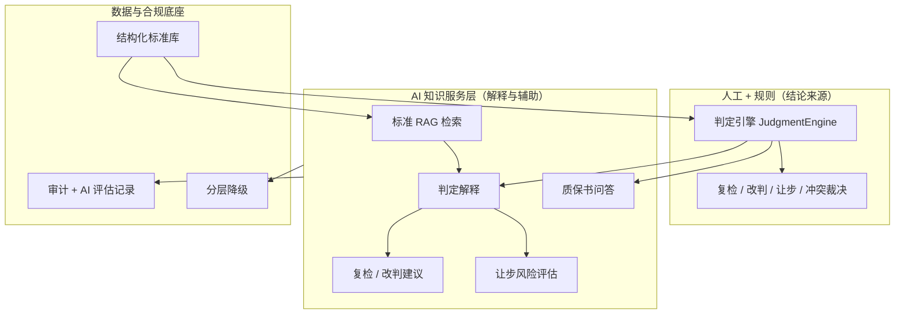

**Agent 本质（三句话）**：

1. 最终执行对象是人，给出结论的是业务系统（判定引擎）— AI 只给建议，不改结论、不操作流程。
2. Agent 是辅助角色 — 没有主动控制能力，不点按钮、不审批、不改数据库。
3. 本质上是加了 RAG 的 Chatbot — 被严格限定在「质量专家」角色，用标准库和历史数据回答问题。

---

## 二、传统业务闭环：从标准到质保书

> 评分要点：完整展示传统主流程，证明系统不是「空壳 AI Demo」，具备真实业务落地基础。

### 2.1 模块总览

| 层级 | 模块 | 核心职责 |
| --- | --- | --- |
| 基础层 | 标准库（维护/指标/覆盖缺口/RAG 源文件） | 规则真相源 + 文档引用源 |
| 执行层 | 检验录入 + 判定引擎 + 判定解释 | 实测值录入 → 自动判定 → 依据快照 |
| 流程层 | 复检 / 改判 / 让步 / 标准冲突 | 异常处置闭环 |
| 输出层 | 质保书数据 / 质量统计 | 合格或已让步产品汇总 |
| 横切层 | RBAC / 审计 / AI 评估 | 合规与可追溯 |

### 2.2 核心业务主链路

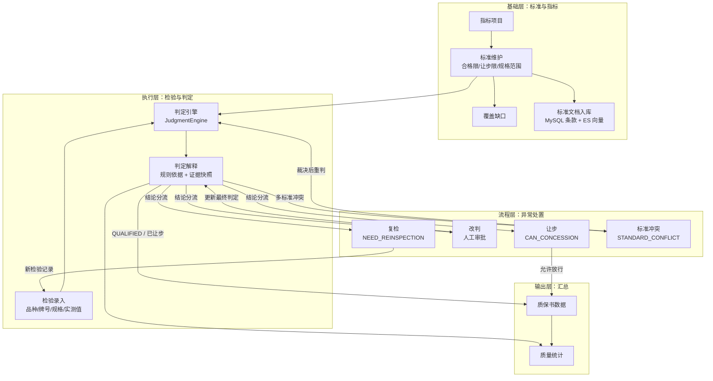

### 2.3 判定引擎四段优先级

单指标取最严重结论，多指标合并后输出最终判定类型：

| 优先级 | 条件 | 结论 |
| ---: | --- | --- |
| 1 | 实测值在合格限内 | `QUALIFIED` 合格 |
| 2 | 超合格限 + 在让步范围内 | `CAN_CONCESSION` 可让步 |
| 3 | 超合格限 + 未配置让步范围 | `NEED_REINSPECTION` 需复检 |
| 4 | 超合格限 + 超出让步范围 | `UNQUALIFIED` 不合格 |

**标准优先级**：客户协议 > 企标 > 国标；多标准合并为 AND，任一不满足则整体不合格。

### 2.4 异常处置闭环

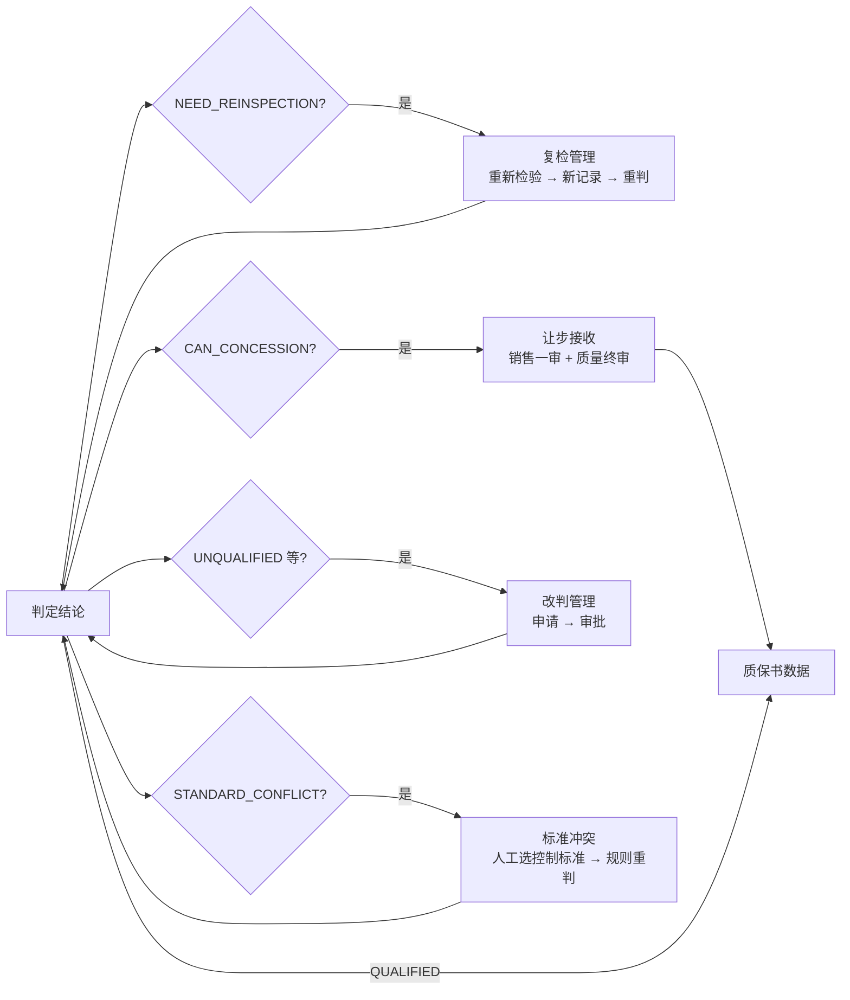

**关键业务规则**：

- **复检**：针对超合格限但未配置让步范围；产生新检验记录，重新走判定链路。
- **改判**：人工指定目标结论类型，审批通过后替换 `is_final=1` 的最终判定；联动作废关联让步。
- **让步**：双签状态机（销售经理一审 → 质量经理终审）；高风险 AI 评估须人工复核。
- **标准冲突**：同优先级标准限值矛盾 → `STANDARD_CONFLICT`；未裁决前禁止正式质保书；裁决后按控制标准**规则重判**（非改判流程）。

### 2.5 数据采集 → 确认上报 → 核准 → 发放（路演演示主线）

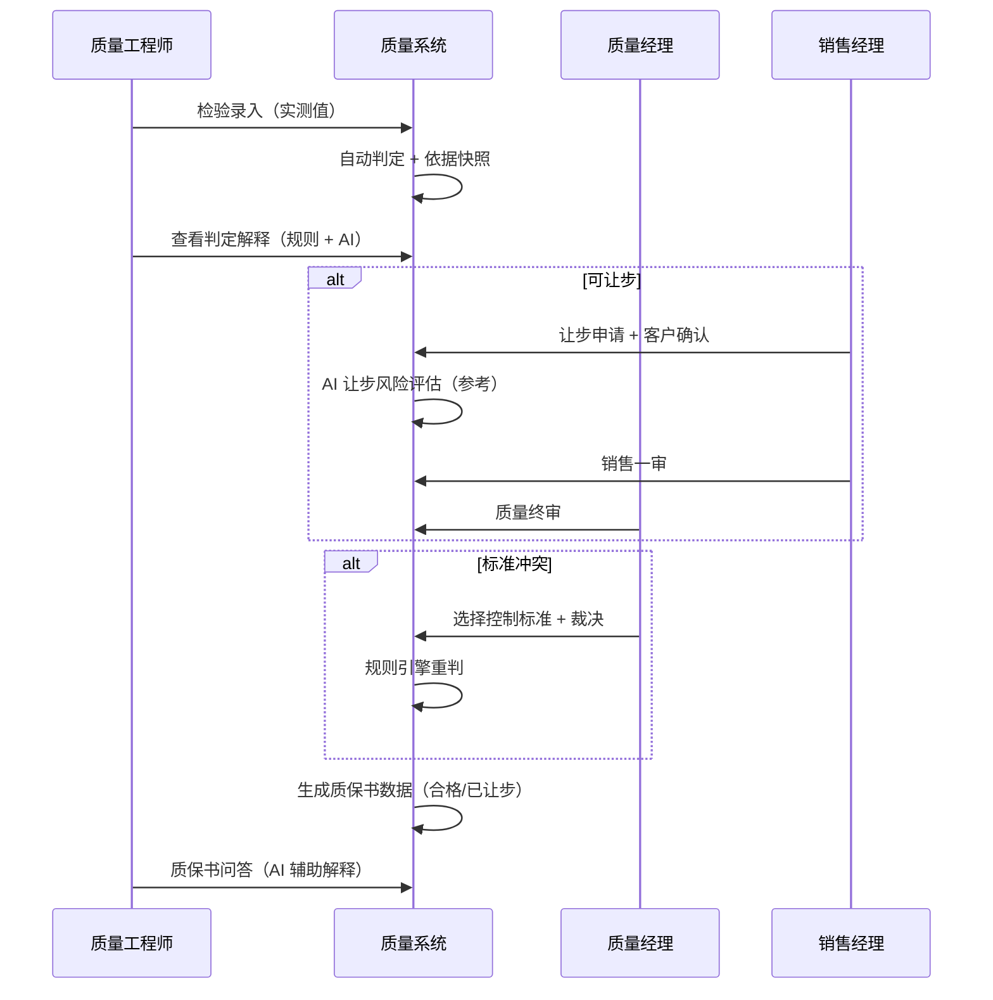

---

## 三、核心 AI 场景：流程、效用与规则对比

> 评分要点：展示 AI 在业务中的具体作用；AI 处理结果 vs 基线规则/人工判断的效果对比，证明 AI 有实际增益。

### 3.1 AI 能力总览

| 场景 | API 入口 | 模型调用 | 是否改变业务结论 | 基线对比 |
| --- | --- | --- | ---: | --- |
| 标准 RAG 检索 | `POST /standard-rag/query` | embed + chat | 否 | vs 人工翻 PDF / 关键词搜索 |
| 判定解释 | `GET /judgments/{id}/explanation` | chat | 否 | vs 纯规则模板文字 |
| 复检建议 | `GET /reinspections/advice/{judgmentId}` | 规则模板（P0） | 否 | vs 人工读指标决定 |
| 改判建议 | `GET /rejudgments/advice/{judgmentId}` | 规则模板（P0） | 否 | vs 人工判断改判方向 |
| 让步风险评估 | `POST /concessions/risk-assessment` | 规则 + chat 润色 | 否 | vs 纯人工经验评审 |
| 标准冲突 | 无独立 AI 建议 API | 判定解释 + 对比 UI | 否 | vs 人工比对多份标准 |
| 质保书问答 | `POST /cert-data/qa` | chat + 缓存 | 否 | vs 人工查质保书 + 标准 |

### 3.2 场景一：标准 RAG 检索

**业务价值**：自然语言查标准，回答必须带来源段落；解决「标准多、查得慢、引用难」痛点。

**流程**：

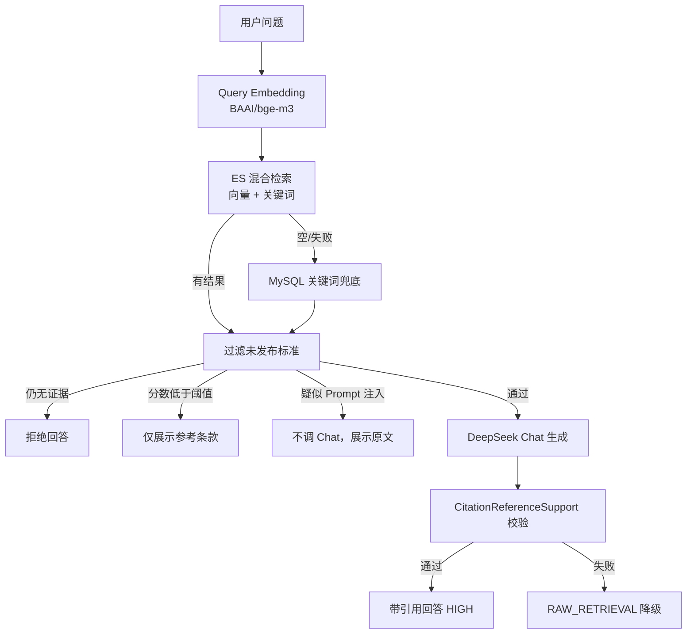

**AI vs 基线**：

| 维度 | 传统方式 | AI RAG |
| --- | --- | --- |
| 查询方式 | 按标准号/章节人工翻 PDF | 自然语言 + 品种/牌号过滤 |
| 回答形式 | 人工摘录 | 生成摘要 + `[1][2]` 编号引用 |
| 无依据时 | 可能凭经验回答 | 明确拒答或仅展示检索片段 |
| 安全性 | 依赖个人经验 | Prompt 注入检测 + 引用 grounded 校验 |

### 3.3 场景二：AI 判定解释

**业务价值**：在规则判定结论不变的前提下，生成可读解释并附标准条款引用。

**流程**：

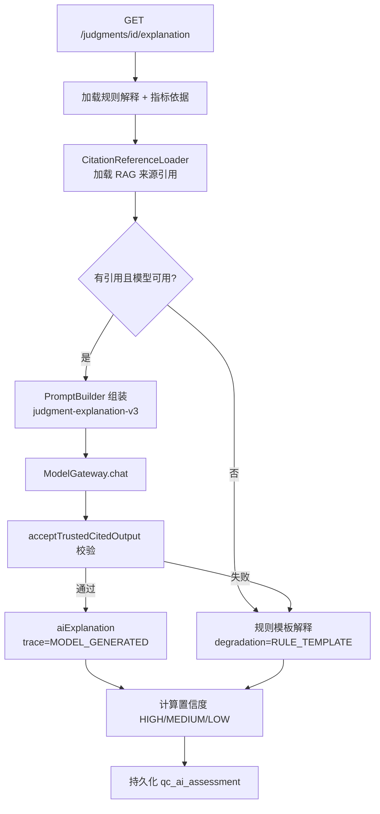

**AI vs 基线**：

| 维度 | 规则模板 | AI 解释（校验通过） |
| --- | --- | --- |
| 可读性 | 结构化字段拼接 | 自然语言叙述 |
| 引用 | 可展示 citations 列表 | 句内 `[n]` 标注，与条款对应 |
| 置信度 | MEDIUM（有引用无 AI） | HIGH（引用 + 校验通过） |
| 结论 | 不变 | **不变** |

### 3.4 场景三：复检 / 改判 AI 建议

**公共底座**：先读取判定解释快照（依据、引用、置信度、冲突列表）。

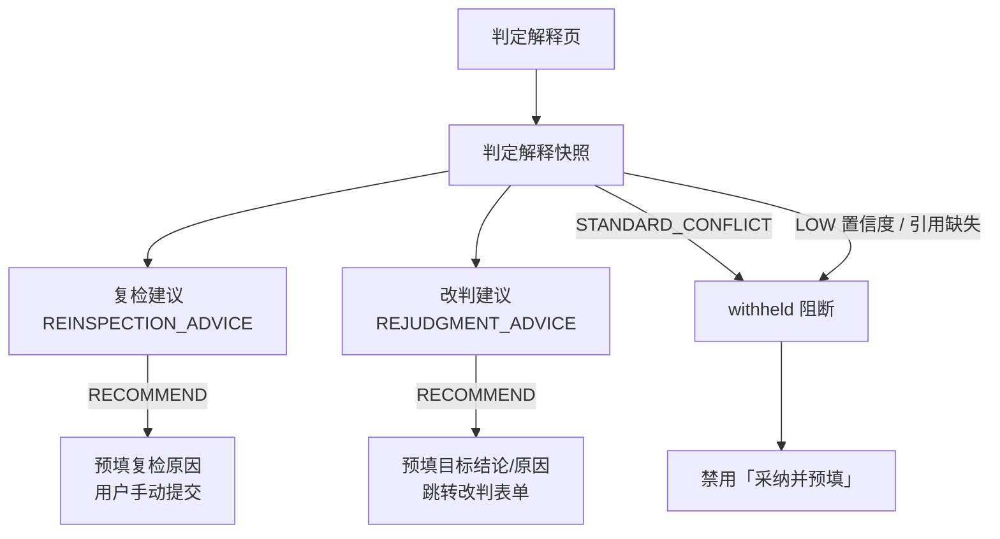

**AI vs 基线**：P0 实现为**规则模板**（`modelProvider=RULE_TEMPLATE`），但相比纯人工：

- 自动汇总异常指标与证据摘要；
- 标准冲突 / 低置信时主动 withhold，避免误导；
- 采纳/忽略写入 `qc_ai_assessment`，可审计。

### 3.5 场景四：让步风险评估

**流程**：

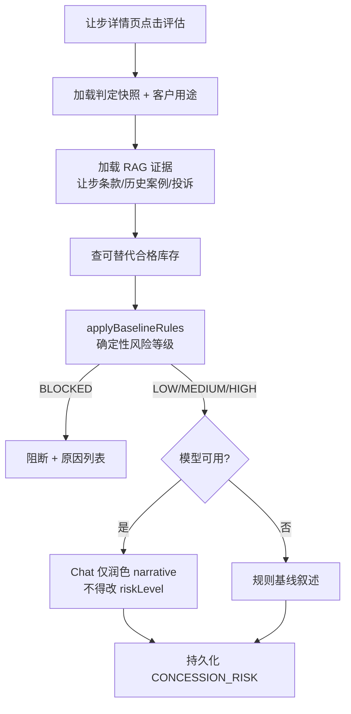

**规则 vs AI 分工**：

| 字段 | 决定方 |
| --- | --- |
| `riskLevel` / `mustReview` / `blockingReasons` | **规则引擎**（确定性） |
| `narrativeExplanation` | AI 润色（可选，无引用校验） |
| 审批状态 | **人工双签**（AI 不影响） |

### 3.6 场景五：标准冲突检测与裁决

**冲突产生（规则，非 AI）**：

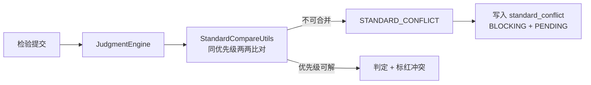

**AI 在冲突中的三个作用**：

1. 判定解释页：强制 LOW 置信度 + 冲突警示，不展示放行结论；
2. 阻断其他 AI 建议（复检/改判 withhold，让步 BLOCKED，质保书禁止）；
3. 裁决后触发规则重判，重新生成解释（`trace=CONFLICT_REJUDGE`）。

**裁决流程**：

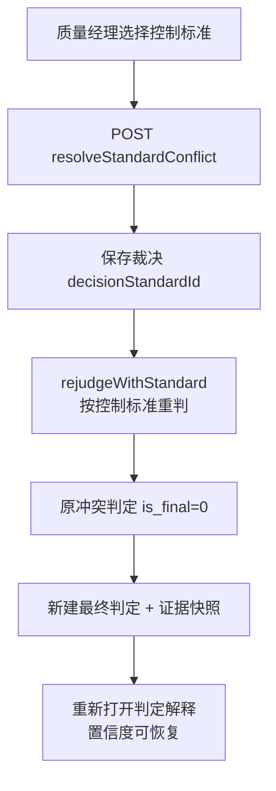

### 3.7 场景六：质保书问答

**流程要点**：

- 按卷号/批次加载质保书快照、最终判定、指标依据；
- 业务状态门禁：冲突/不合格/让步未批 → 明确标注非最终态；
- 支持 AI 缓存（演示场景），回放仍过引用校验；
- 引用校验通过 → GENERATED；否则 RULE_TEMPLATE / RAW_RETRIEVAL。

**AI vs 基线**：客服/销售无需同时打开质保书、判定详情、标准 PDF 三处对照，系统一次性给出带引用的结构化回答。

---

## 四、技术架构、AI 调用链与可观测性

> 评分要点：AI 调用链回放、Prompt 版本切换与对比、审计看板。

### 4.1 总体技术架构

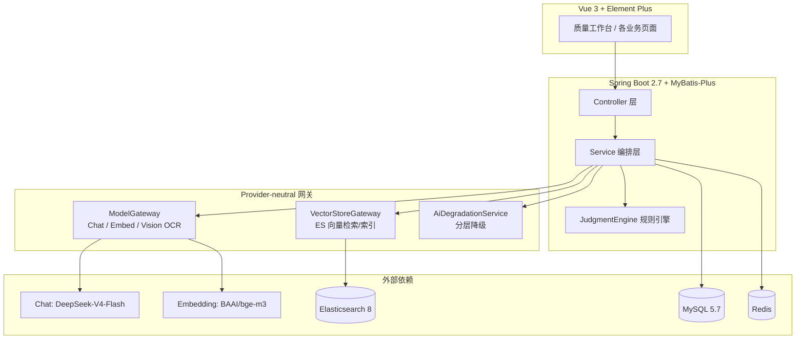

### 4.2 技术选型摘要

| 层次 | 选型 | 理由 |
| --- | --- | --- |
| 后端 | Java 8 + Spring Boot 2.7 | 企业环境兼容、生态成熟 |
| 数据 | MySQL 5.7 + MyBatis-Plus | 复杂业务 SQL 可控 |
| 缓存/鉴权 | Redis + Sa-Token | 会话与分布式鉴权 |
| 前端 | Vue 3 + TS + Vite + Element Plus | 企业后台、类型安全 |
| AI 网关 | ModelGateway（OpenAI-compatible） | 厂商可切换，USB-C 式接口 |
| 向量库 | VectorStoreGateway → ES 8 | 混合检索、元数据过滤 |
| 文档解析 | PDFBox / POI + Vision OCR | 多格式标准入库 |
| 规范驱动 | OpenSpec | 增量 spec、brown-field 友好 |

### 4.3 AI 模型选型

| 用途 | 模型 | 平台 | 说明 |
| --- | --- | --- | --- |
| Chat（解释/RAG/问答/润色） | `deepseek-ai/DeepSeek-V4-Flash` | 硅基流动 | 低延迟，适合 RAG 链路 |
| Embedding（条款/问句向量化） | `BAAI/bge-m3` | 硅基流动 | 与 Chat 模型解耦配置 |
| Vision OCR（扫描件/image） | `deepseek-ai/DeepSeek-OCR` | 硅基流动 | 图片标准源文件提取 |

配置通过 `application.yml` 环境变量占位注入，**不写死密钥**。

### 4.4 RAG 双轨设计

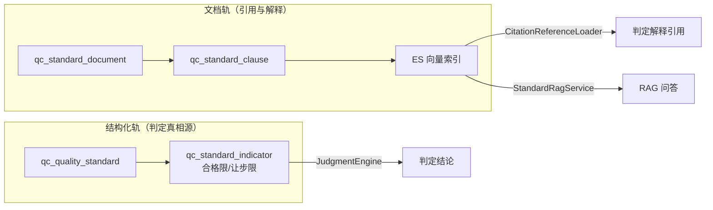

**原则**：结构化限值为唯一判定依据；RAG 原文只做检索/引用/解释，二者不一致时以结构化为准并产生维护告警。

### 4.5 AI 置信度机制

置信度表示「这次 AI 输出在现有证据下有多可靠」，**不改变规则判定结论**。

| 字段 | 含义 |
| --- | --- |
| `confidenceLabel` | HIGH / MEDIUM / LOW |
| `confidenceScore` | 0～1 数值 |
| `confidenceFactors` | 影响因素说明列表 |

**判定解释置信度规则（当前 P0 实现）**：

| 条件 | 置信度 |
| --- | --- |
| `STANDARD_CONFLICT` 或未裁决 BLOCKING 冲突 | 强制 LOW（0.2） |
| 未命中结构化标准（覆盖缺口） | 强制 LOW |
| 引用命中 + AI 解释通过校验 | HIGH（0.85） |
| 引用命中但无 AI 解释 | MEDIUM（0.7） |
| 引用缺失 | MEDIUM（0.6），`citationMissing=true` |

**下游门禁**：LOW 或引用缺失 → 复检/改判建议 **withheld**，前端禁用「采纳并预填」。

> 说明：OpenSpec 设计了可配置加权公式（规则 0.6 + RAG 0.3 + LLM 0.1），管理页已具备读写能力；主链路当前仍以各 Service 内确定性规则为主，路演时建议区分「已落地」与「后续扩展」。

### 4.6 AI 解释内容校验（Citation Grounded）

核心入口：`CitationReferenceSupport.acceptTrustedCitedOutput()` — 模型输出只有通过校验才会被采纳。

```mermaid
flowchart TD
    IN[模型输出 + citations + evidences] --> G1{输出非空<br/>引用列表非空?}
    G1 -->|否| REJ[拒绝 → 降级]
    G1 -->|是| G2{每条引用<br/>paragraphText 完整?}
    G2 -->|否| REJ
    G2 -->|是| G3{含 [n] 或条款号?}
    G3 -->|否| REJ
    G3 -->|是| G4[逐 [n] grounded 校验]
    G4 --> G4A{上下文涉及数值/限值?}
    G4A -->|是| G4B{第 n 条段落<br/>能支撑该数值?}
    G4B -->|否| REJ
    G4A -->|否| OK
    G4B -->|是| OK[接受输出]
    OK --> HIGH[可能 HIGH 置信度]
    REJ --> DEG[规则模板 / RAW_RETRIEVAL]
```

**禁止行为**：用「适用范围」「术语定义」等无数值段落冒充限值依据；引用编号越界；上下文数字在段落中找不到。

**例外**：让步风险润色不做引用校验，仅检查调用成功与非空 — 风险等级已由规则确定。

### 4.7 分层降级路径

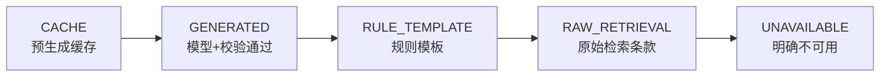

**业务保障**：模型或 ES 不可用时，规则判定、审批流转、结构化数据视图仍可继续。

### 4.8 Prompt 集中管理与版本化

系统已实现 **Prompt Registry**（`backend/src/main/resources/ai-prompts/`）：

| 场景 | 活跃版本 | 文件位置 |
| --- | --- | --- |
| 判定解释 | `judgment-explanation-v3` | `ai-prompts/judgment-explanation/` |
| 标准 RAG | `standard-rag-p0-v3` | `ai-prompts/standard-rag/` |
| 质保书问答 | `cert-qa-v4` | `ai-prompts/cert-qa/` |
| 让步风险 | `concession-risk-v1` | `ai-prompts/concession-risk/` |
| Vision OCR | `vision-ocr-v1` | `ai-prompts/vision-ocr/` |

**三层 Prompt 结构**：

| 层级 | 内容 | 管理方式 |
| --- | --- | --- |
| Layer 1 策略与红线 | systemPrompt、引用规则、temperature | Git 资源文件 + manifest.yaml |
| Layer 2 场景骨架 | user-skeleton 标题与占位符 | Git 资源文件 |
| Layer 3 动态事实 | 判定结论、指标实测、citations 块 | 运行时 PromptBuilder 拼装 |

每次 AI 调用将 `promptVersion` 写入 `qc_ai_assessment`，支持版本对比与审计回放。

### 4.9 AI 评估审计与可观测性

所有 AI 输出统一写入 `qc_ai_assessment`：

| assessmentType | 触发场景 |
| --- | --- |
| `JUDGMENT_EXPLANATION` | 打开判定解释 |
| `REINSPECTION_ADVICE` | AI 复检建议 |
| `REJUDGMENT_ADVICE` | AI 改判建议 |
| `CONCESSION_RISK` | 让步风险评估 |
| `STANDARD_RAG` / `CERT_QA` | RAG 问答 / 质保书问答 |

**可观测字段**：输入快照、输出文本、引用 JSON、模型 provider、promptVersion、degradationSource、confidenceLabel/Score/Factors、adoptionStatus（ADOPTED/IGNORED/PENDING）。

**管理入口**：

- `/ai-assessments` — AI 评估审计列表，按类型/置信度筛选；
- `/admin/ai-confidence` — 置信度权重配置；
- 质量工作台 — 低置信复核待办计数。

---

## 五、AI 开发过程与工作流

### 5.1 规范驱动开发（SDD + BDD + TDD）

| 层次 | 实践 | 关注点 |
| --- | --- | --- |
| 宏观 | OpenSpec（SDD） | 系统契约、增量 spec、一致性 |
| 业务 | BDD 场景 | 业务价值、验收标准 |
| 实现 | TDD | 编码正确性、回归保护 |

**为何选用 OpenSpec 而非 spec-kit**：本项目为 brown-field（1→n）增量增强；OpenSpec 支持 Delta Specs 与渐进式规范增强，避免多 feature 分支导致 AI「局部视野」与规范膨胀。

### 5.2 开发工作流

```plain
需求分析与澄清：OpenSpec explore + grill-me（26 个澄清问题）
        ↓
详细设计与任务拆解：proposal / design / specs / tasks
        ↓
需求设计质量检测：高级模型评审 spec 一致性与 MVP 边界
        ↓
实现：OpenSpec apply（100+ 任务项）
        ↓
测试验证：模块自动化测试 + 30 条评估集 + 人工审核
        ↓
需求归档：OpenSpec archive → 合并至 openspec/specs/
```

### 5.3 使用的 Skill 与模型分工

**开发过程模型**：

| 阶段 | 模型 |
| --- | --- |
| 主导设计与实现 | GPT-5.5 High（Codex） |
| 需求设计评审 | GPT-5.5 Extra High |
| 测试验证与修复 | Composer 2.5 Fast |

**Skill 清单**：

| Skill | 用途 |
| --- | --- |
| grill-me | 需求三轮拷问与澄清 |
| web-access | 联网获取 API 文档与领域资料 |
| frontend-design | UI 风格设计 |
| mock-std-*-generate | 模拟标准 PDF/Excel/图像生成 |
| openspec-* | 规范变更全生命周期 |
| skill-creator | 自定义 Skill 辅助 |

### 5.4 已归档 OpenSpec 能力规格

主规格位于 `quality-control/openspec/specs/`：

| 规格 | 能力 |
| --- | --- |
| `standard-rag-retrieval` | 标准入库、分块、向量检索、注入防护 |
| `ai-judgment-explanation` | 判定解释、引用、置信度、持久化 |
| `concession-risk-assessment` | 让步风险规则 + AI 润色 |
| `reinspection-rejudgment-advice` | 复检/改判建议、withhold、采纳审计 |
| `standard-conflict-detection` | 冲突检测、裁决、重判 |
| `quality-cert-qa` | 质保书问答、非最终态处理 |
| `quality-cert-ai-pdf` | 质保书 PDF 导出 |
| `ai-gateway-degradation` | 网关抽象与分层降级 |
| `ai-confidence-config` | 置信度权重配置 |
| `demo-evaluation-dataset` | 演示与评估数据集 |
| `ai-interaction-ux` | AI 场景加载反馈 UX |

---

## 六、运营成本、已知限制与推广路径

### 6.1 运营成本估算

| 成本项 | 说明 | 可控手段 |
| --- | --- | --- |
| Chat 模型调用 | 判定解释、RAG、问答、润色 | temperature=0.1；无证据不调 Chat；缓存 |
| Embedding 调用 | 入库向量化 + 问句向量化 | 确定性分块；批量 embed；失败降级文本检索 |
| ES 向量索引 | 存储与检索 | 仅已发布标准；按 document 增量索引 |
| Vision OCR | 图片标准解析 | 可选启用；结果标记 reference-only |
| 基础设施 | MySQL / Redis / ES | 与现有企业栈复用 |

**降级保障**：AI 不可用时核心质检流程零中断 — 规则判定、审批、结构化视图照常。

### 6.2 已知限制（诚实披露）

| 限制 | 现状 | 影响 |
| --- | --- | --- |
| 置信度加权公式 | 配置页已有，主链路未完全接入加权计算 | 路演区分「配置预留」与「运行时规则」 |
| 复检/改判建议 | P0 为规则模板，非 LLM 推理 | 仍具备 withhold 与预填价值 |
| ES 默认配置 | dev 环境可能 `ES_VECTOR_ENABLED=false` | 向量检索降级为 DB 关键词 |
| 改判逆向矩阵 | 规范 FR-008 与部分实现略有差异 | 合格→可让步当前为常规改判 |
| OCR 非确定性 | 扫描件识别为 reference-only | 不覆盖结构化限值 |

### 6.3 推广路径

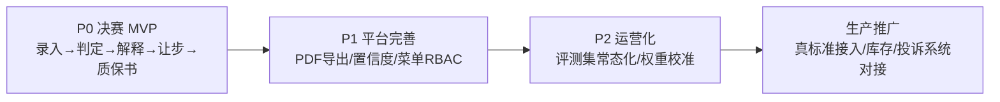

**分阶段建议**：

1. **试点（1～2 产线）**：导入结构化标准 + 20 份源文档 RAG 索引；启用判定解释与 RAG 检索。
2. **扩展（全厂质检）**：接入让步风险评估、冲突检测、质保书问答；建立 AI 评估审计复核流程。
3. **生产化**：替换模拟标准为真实国标/企标/客户协议；对接库存与投诉系统；启用 ES 向量检索与置信度加权校准。
4. **持续运营**：30+ 条评估集定期回归；Prompt 版本 A/B 对比；低置信/高风险人工复核 KPI 纳入质量统计。

### 6.4 演示数据与评测

| 资产 | 规模 | 用途 |
| --- | --- | --- |
| 标准/协议文档 | 20 份（国标/企标/客户协议） | RAG 入库与检索演示 |
| 检验记录 | 100 条 | 覆盖合格/不合格/复检/让步/冲突 |
| 冲突样例 | 5 个 | 冲突检测与裁决演示 |
| 评估集 | 30 条 | 正常/边界/低置信/注入安全 |

---

## 七、总结

### 7.1 系统价值总结

本系统将 AI 严格约束在「质量专家知识服务」角色内：

- **有真实业务底座**：标准库、判定引擎、复检/改判/让步/冲突、质保书、审计完整闭环。
- **AI 有实际增益**：RAG 检索提速、判定解释可读化、让步风险结构化、问答降本、建议预填提效。
- **可信可审计**：引用 grounded 校验、置信度门禁、Prompt 版本、qc_ai_assessment 全链路记录、分层降级。
- **可推广可运营**：网关抽象、配置外置、评估集可复测、分阶段推广路径清晰。

### 7.2 不足与后续方向

- 置信度加权公式与管理页配置打通主链路计算；
- 复检/改判建议引入 LLM 增强（在 withhold 门禁保留前提下）；
- 改判逆向矩阵与规范 FR-008 完全对齐；
- 生产环境 ES 向量检索默认启用与索引运维工具；
- 让步场景销售侧客户知会通知完善；
- 结构化标准 vs RAG 原文一致性自动巡检。

### 7.3 启发

1. **规则优先 + AI 辅助** 是工业质检 AI 落地的正确姿势 — 合规场景不能让模型「替人签字」。
2. **RAG 不是判据而是引用源** — 双轨设计避免 AI 幻觉污染判定。
3. **Citation Grounded 校验** 比 Prompt 约束更可靠 — 「怎么说」可配置，「能不能过」留代码。
4. **OpenSpec 增量 spec** 适合 brown-field AI 增强 — 规范与代码同步演进，避免 Demo 式堆功能。

### 7.4 相关参考

| 资源 | 链接 |
| --- | --- |
| OpenSpec | https://github.com/Fission-AI/OpenSpec |
| spec-kit | https://github.com/github/spec-kit |
| grill-me Skill | https://github.com/mattpocock/skills |
| 硅基流动 API 文档 | https://api-docs.siliconflow.cn/docs/api/chat-completions-post |
| 项目 OpenSpec 主规格 | `quality-control/openspec/specs/` |
| Prompt 资源目录 | `quality-control/backend/src/main/resources/ai-prompts/` |

---

*文档生成日期：2026-06-28*  
*输出路径：`/Users/weixuelei/workspace/aiAgent/ai-project/ppt/result/系统总说明介绍.md`*
